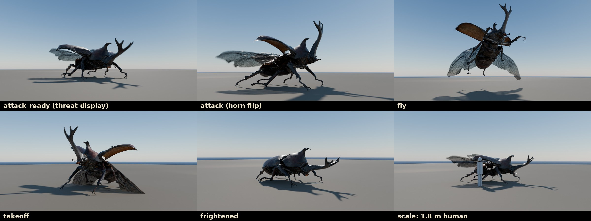

# Creatures

Rigged, animated creatures built from photogrammetry scans. Each creature is self-contained in its own folder:
its raw scans, the finished models, textures, preview renders and the pipeline that produced them.

| Creature | Folder | Contents |
|---|---|---|
| Giant rhinoceros beetle (*Trypoxylus dichotomus*) | [`rhinoceros-beetle/`](rhinoceros-beetle/) | Full-res and game GLB, 47-bone rig, 14 animations (idle, walk, run, attack, frightened, flee, takeoff, fly, land…) |
| Warrior of the Mind (hero character) | [`Warrior_Of_The_Mind/`](Warrior_Of_The_Mind/) | Built from 6 reference paintings: 221k-tri model, humanoid rig + 51 spring-bone chains, 40 animations (mocap + keyframed), Godot 4.7 project with Jolt ragdoll, cloth/hair physics, showcase and playable controller |



## Adding a new creature

Use the same layout as the beetle, so every creature has the same structure:

```
<creature-name>/
├── source/      raw scans / reference models (unmodified)
├── <name>.glb, <name>_game.glb, <name>.blend
├── textures/
├── renders/     stills + videos/
├── pipeline/    scripts; run_all.sh rebuilds everything from source/
└── README.md    scale, skeleton, animation list, notes
```

The pipeline scripts in `rhinoceros-beetle/pipeline/` are organised so parts can be reused:

* **Generic:** `gl.py` (glTF/numpy loader), `geo.py` (geodesics), `icp.py` / `nonrigid.py` (scan registration and fitting), `anim_lib.py` (procedural animation toolkit: noise, easing, gaits, baking), `export_glb.py`, `game_*.py` (decimate, re-unwrap, bake the game LOD), `rsetup.py` / `reel.py` / `render_frames.py` (Cycles previews), `verify.py` / `seamcheck.py` (IK and loop checks).
* **Beetle-specific:** segmentation parameters, joint picking, wing fold, and `clips.py` (the animations themselves).
