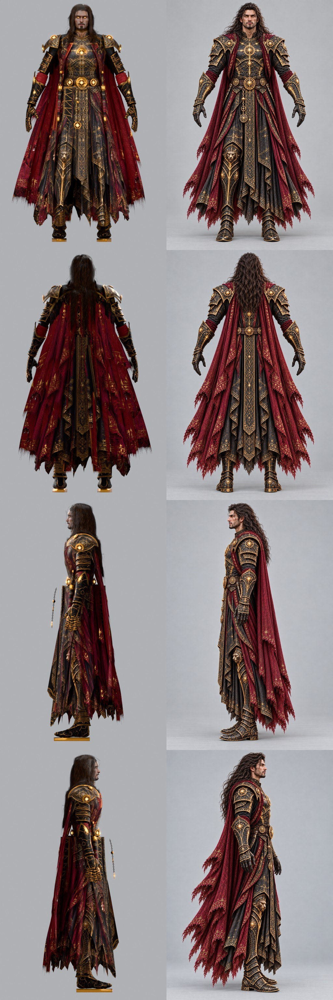
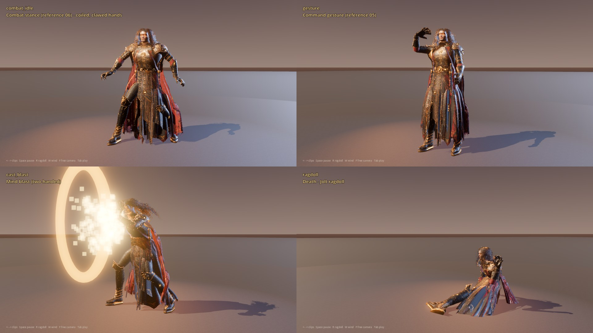

# Warrior of the Mind: rigged, animated hero for Godot 4.7

A game-ready, fully rigged and animated main character built from the six reference paintings in
`Reference-Images/`. It comes with a complete **Godot 4.7 project** (`godot/`) that shows every animation,
**physics-driven cloth and hair** (spring bones), a **Jolt ragdoll** death, VFX, and a **playable
third-person controller**.



In Godot 4.7 (combat stance, command gesture, mind blast, Jolt ragdoll death):



**Video:** [`renders/videos/showreel.mp4`](renders/videos/showreel.mp4) is every clip recorded from the Godot showcase, with spring-bone cloth and hair, VFX and the ragdoll.
Face close-ups vs. reference: [`renders/compare_face.jpg`](renders/compare_face.jpg).

## Folder layout

```
Warrior_Of_The_Mind/
├── Reference-Images/            the six source paintings (unmodified)
├── warrior_of_the_mind.blend    Blender 5.0 source: meshes, materials, rig, all 40 actions
├── textures/                    4k PNG texture sets (armor, cloth, body, hair, eyes)
├── godot/                       Godot 4.7 project (Jolt physics)
│   ├── assets/warrior/          warrior.gltf + .bin + WebP textures, chains.json, clips.json
│   ├── scenes/                  showcase.tscn (main), playground.tscn (playable), warrior.tscn
│   ├── scripts/                 warrior_rig.gd, player.gd, lean_modifier.gd, vfx.gd, env_builder.gd ...
│   └── tools/record.sh          records the showcase to MP4 (deterministic --write-movie)
├── renders/                     stills and videos
└── pipeline/                    scripts that rebuild everything from the reference images
```

## Opening it in Godot

1. Open `godot/project.godot` in **Godot 4.7** (the project uses **Jolt Physics**, set in *Project Settings > Physics > 3D*).
2. Press **F5**. The **showcase** plays every clip in order with an orbiting camera.
   * `←` / `→` previous / next clip, `Space` pause, `R` ragdoll death, `W` toggle wind, `F` free camera, `Tab` playable scene.
3. **Playground** (`scenes/playground.tscn`, or `Tab` from the showcase): third-person controller.
   * `WASD` move (camera-relative), `Shift` sprint, `Ctrl` walk, `Space` jump, mouse look, wheel zoom
   * `LMB` summon sword, then a 3-hit combo (forehand, backhand, leaping smash) · `RMB` mind bolt · `F` mind blast · `G` command gesture
   * `Q` / `E` dodge, `C` dive roll, `X` combat stance, `H` take a hit, `K` ragdoll death, `Enter` get up
   * walk into the ladder and hold `W` to climb (`S` down, `Space` let go)

### Using the character in your own game

Instance `scenes/warrior.tscn`. Its script (`warrior_rig.gd`) sets everything up at runtime:

| Feature | How |
|---|---|
| Animations | `play(clip, blend, speed)` cross-fades and fires the clip's events (`anim_event(clip, event)` signal) |
| Root motion | the `Root` bone carries it: `take_root_motion()` returns this frame's motion (world space) |
| Cloth & hair physics | `SpringBoneSimulator3D` per group (cape, robe skirt, tabards, stoles, hair, pendant, daggers), built from `chains.json`, with capsule colliders on legs, hips, torso, arms and head. Parameters are in `GROUPS` in the script. `wind_strength` adds gusting wind. |
| Ragdoll | `PhysicalBoneSimulator3D` (18 capsule bodies, cone and hinge joints, simulated by Jolt). `die_ragdoll(impulse)` / `stop_ragdoll()`. Cloth and hair keep simulating on the ragdoll. |
| Procedural lean | `LeanModifier` (SkeletonModifier3D) banks the body into turns and pitches it with acceleration (`player.gd` drives it) |
| Head look-at | `LookAtModifier3D` (`set_look_target(node)`) |
| Sword | a separate skinned mesh on the `SwordSocket` bone. Its scale is animated, so it appears in the sword clips (`sword_summon` materialises it) and is hidden otherwise. |
| Casting points | `RCastSocket` / `LCastSocket` bones in the palms (bolt and blast spawn there) |

Scale: metres, **1.94 m** tall (1.97 m with boots), facing **+Z** in Godot (glTF convention), feet on y = 0.

## Model

* **~221k triangles, 6 materials / draw calls** (Body, Armor, Cloth, Hair, Eyes, Sword).
* **Body:** MakeHuman CC0 base mesh. It is re-proportioned to the skeleton measured on the reference turnaround (1.34 mm/px, joint by joint), with a young athletic build and a narrow waist. The head keeps its sculpted shape (character targets: strong brow, cheekbones and chin, straight nose). The painting is aligned to it by a 478-landmark 2D warp (`face_warp.py`) instead of deforming the head.
* **Armor** (all procedural, measured on the references): gorget, cuirass, pauldrons with gothic points, medallions and articulated lames, vambraces with pointed elbows, wrist cuffs, articulated gauntlet plates, lion-head knee cops (relief from the painting), greaves, ankle lames, sabatons, belt with compass-star medallions, faulds, sheathed daggers, and a chain with an orb, ring and pendant.
* **Cloth:** inner and outer robes with handkerchief hems, front and back tabards and side panels, red stoles, a three-tier split cape with diagonal torn hems, and red forearm wraps.
* **Hair:** ~920 textured cards from simulated guide strands (gravity, collision with head, armor and cape), ringlet curls, face-framing strands. Card-based beard and stubble; golden glowing irises.
* **Textures (4k):** colour is **projected from the 4× upscaled paintings** (Real-ESRGAN) with depth-buffer occlusion, low-frequency de-lighting and left/right symmetrisation. Where no view sees the surface, it is filled with matching procedural ornament: 3D Voronoi gold filigree, double border lines along every plate edge, compass stars, damask, lace hems. Normal, ORM and emission maps are derived from the same data: gold filigree and stars glow (emission), the plates are dark lacquered metal.

## Skeleton

Godot `SkeletonProfileHumanoid` bone names (retargeting-ready): `Root > Hips > Spine > Chest > UpperChest > Neck > Head`,
arms `Left/RightShoulder > UpperArm > LowerArm > Hand` with 15 finger bones each, legs `Left/RightUpperLeg > LowerLeg > Foot > Toes`,
`Jaw`, `Left/RightEye`, plus sockets (`SwordSocket`, `RCastSocket`, `LCastSocket`) and **51 dynamic chains**
(`Cape*`, `Skirt*`, `Tabard*`, `Panel*`, `Stole*`, `Hair*`, `Pendant`, `Dagger*`). **292 bones** in total.

## Animations (30 fps, 40 clips)

Locomotion is **retargeted motion capture** (CMU Graphics Lab database): global-rotation transfer with rest-pose correction, loops cut at the best pose match and cross-faded, root motion extracted and smoothed. A heroic posture layer and finger poses are added on top. Combat, magic, stances and reactions are **key-framed** with an authoring toolkit: IK-planted feet, arm IK with hand orientation, anticipation, overshoot springs for follow-through, breathing and noise.

| Group | Clips |
|---|---|
| Stances | `idle` (6 s: weight shifts, look-arounds, breathing), `combat_idle` (reference 06), `gesture` (reference 05), `sword_idle` |
| Locomotion (loops, in place; speeds in `clips.json`) | `walk` 1.31 m/s, `jog` 3.3, `run` 4.55, `sprint` 6.2, `climb`, `fall` |
| Direction changes | `run_start`, `run_stop`, `run_turn_left/right`, `sidestep_left/right`, `turn_left_90/right_90/180` |
| Evasion | `dodge_left/right/back`, `dive_roll` |
| Jumping | `jump`, `jump_forward`, `run_jump` |
| Climbing | `climb` (loop, in place, climb speed in `clips.json`), `climb_ladder` (full ladder climb) |
| Shooting (magic) | `cast_bolt` (event `release`), `cast_blast` (two-handed) |
| Sword | `sword_summon`, `sword_slash_1/2/3` (combo, events `hit` and `combo_window`), `sword_spin` |
| Reactions | `hit_front`, `hit_back` |
| Death | `death_backward`, `death_thrown`, plus the **Jolt ragdoll** at runtime; `get_up_front/back` |

Root motion is on the `Root` bone for the one-shot clips (turns, dodges, rolls, attacks). The loops are in place. Match the ground speed with the controller (see `player.gd`, which also scales the playback rate so the feet don't slide).

## Rebuilding

`pipeline/run_all.sh` rebuilds everything from the reference images. Requirements: Python 3.11, `bpy==5.0.1`, numpy, scipy, opencv, numba, torch (Real-ESRGAN upscaling, CPU), mediapipe. Also:
[MakeHuman](https://github.com/makehumancommunity/makehuman) `data/` (CC0) in `$MH_DATA`, the Real-ESRGAN x4plus weights in `$ESRGAN`,
the MediaPipe face/pose models, and the CMU `.asf/.amc` files in `$CMU_DIR`.

| Stage | Script |
|---|---|
| Reference analysis | `stage0_segment.py` (masks), `stage0_landmarks.py`, `upscale.py` (Real-ESRGAN 4×), `views.py` (camera calibration) |
| Body and face | `mh.py`, `body_fit.py`, `face_warp.py` (texture-side landmark warp; `face_fit.py` holds the landmark tools) |
| Geometry | `kit.py` (radial-surface kit), `armor.py`, `cloth.py`, `hair.py`, `build.py` |
| Texturing | `uvlayout.py`, `bake_maps.py` (texel-space G-buffer), `project_tex.py` (painting projection), `tex_armor.py`, `tex_cloth.py`, `tex_body.py`, `tex_hair_eyes.py`, `materials.py` |
| Rig | `rig.py` (skeleton, dynamic chains, skin weights, sockets) |
| Animation | `mocap.py` (ASF/AMC), `retarget.py`, `animlib.py`, `authoring.py`, `anims.py` |
| Export | `export_godot.py` (glTF + WebP), `render_ref.py` / `anim_sheet.py` / `width_check.py` (checks) |

## Credits and licences

* Base human mesh, rig weights, eye textures: **MakeHuman** (CC0).
* Motion capture: **CMU Graphics Lab Motion Capture Database**, http://mocap.cs.cmu.edu (created with funding from NSF EIA-0196217).
* Upscaling: Real-ESRGAN (BSD-3). Landmarks: MediaPipe (Apache-2.0).
